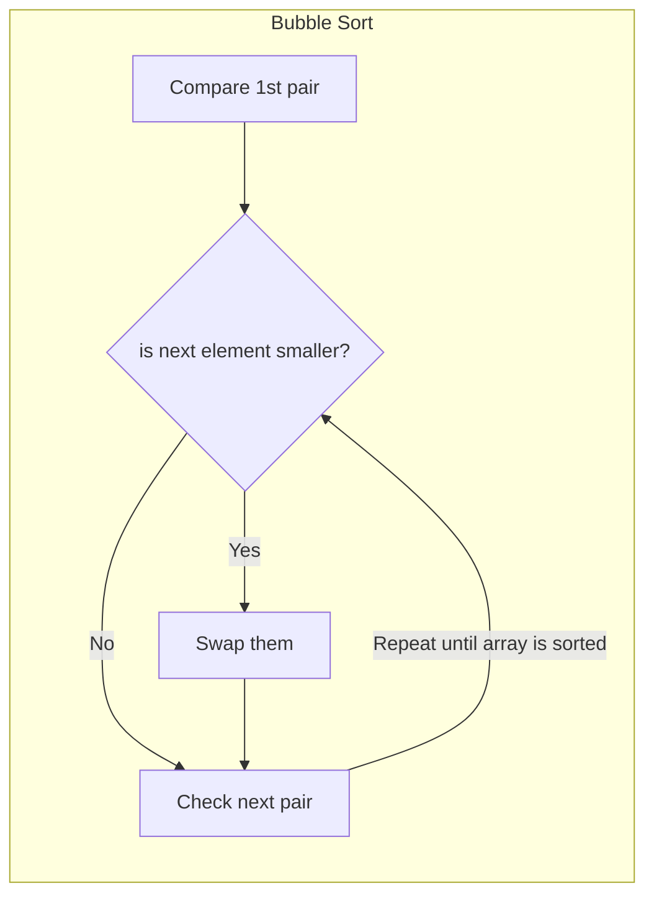
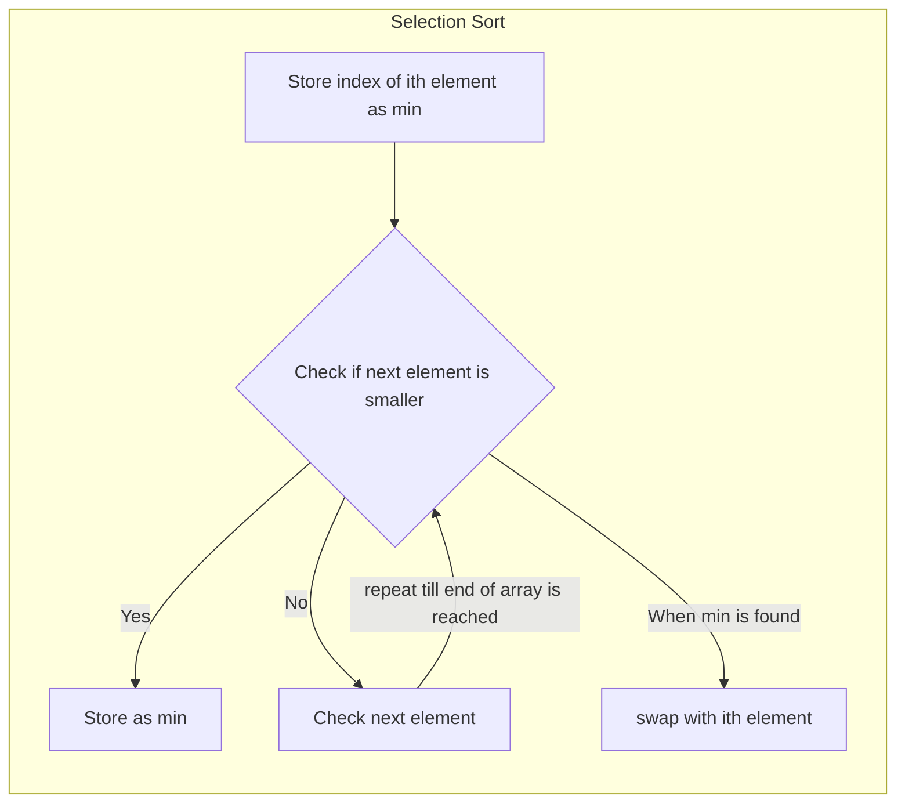
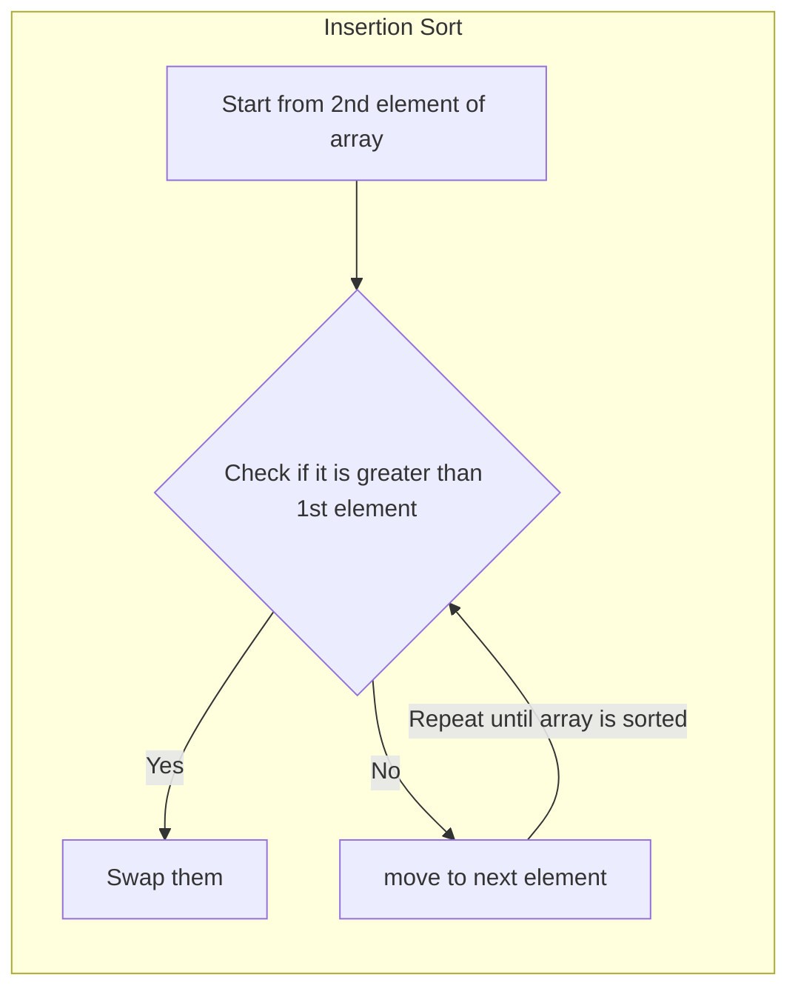

# Elementary Sorting Algorithms

## Bubble Sort

Simplest sort algorithm

$`O(N^2)`$ time complexity



```c++
//Example
// 5, 3, 10, -1
// 3, 5, 10, -1 // 3 and 5 are swapped
// 3, 5, 10, -1 // no swaps
// 3, 5, -1, 10 // -1 and 10 are swapped
// 3, -1, 5, 10 // -1 and 5 are swapped
// -1, 3, 5, 10 // -1 and 3 are swapped

void swap(int &a, int &b)
{
    int temp = a;
    a = b;
    b = temp;
}

void bubble_sort(std::vector<int> &v)
{
	for (size_t i = 0; i < v.size(); i++)
	{
		for (size_t j = 0; j + i < v.size() - 1; j++)
			if (v.at(j) > v.at(j + 1))
				swap(v.at(j), v.at(j + 1));
	}
}

void optimized_bubble_sort(std::vector<int> &v)
{
    //this exits early for sorted vector
	bool swapped{false};
	for (size_t i = 0; i < v.size(); i++)
	{
		swapped = false;
		for (size_t j = 0; j + i < v.size() - 1; j++)
			if (v.at(j) > v.at(j + 1))
			{
				swap(v.at(j), v.at(j + 1));
				swapped = true;
			}
		if(swapped == false)
			break;
	}
}
```

## Selection Sort

$`O(N^2)`$ time complexity

**Use when number of swaps is needed to be minimum**



```c++
void selection_sort(std::vector<int> &v)
{
	int min{0};
	for (size_t i = 0; i < v.size(); i++)
	{
		min = i;
		for (size_t j = i + 1; j < v.size(); j++)
			if (v.at(min) > v.at(j))
				min = j;
		swap(v.at(min), v.at(i));
	}
}
```

## Insertion Sort

Really fast for nearly sorted array



```c++
// Example
// 5, 3, 10, -1
// 3, 5, 10, -1 // 3 and 5 are swapped
// 3, 5, 10, -1 // no swaps
// 3, 5, 10, 10 // 10 is placed in place of -1
// 3, 5, 5, 10 // 10 is replaced with 5
// 3, 3, 5, 10 // 5 is replaced with 3
// -1, 3, 5, 10 // -1 is placed in place of 3

void insertion_sort(std::vector<int> &v)
{
	for (int i = 1; i < v.size(); i++)
	{
		int current_val = v.at(i), j{0};
		for (j = i - 1; j >= 0 && v.at(j) > current_val; j--)
			v.at(j + 1) = v.at(j);
		v.at(j + 1) = current_val;
	}
}
```
