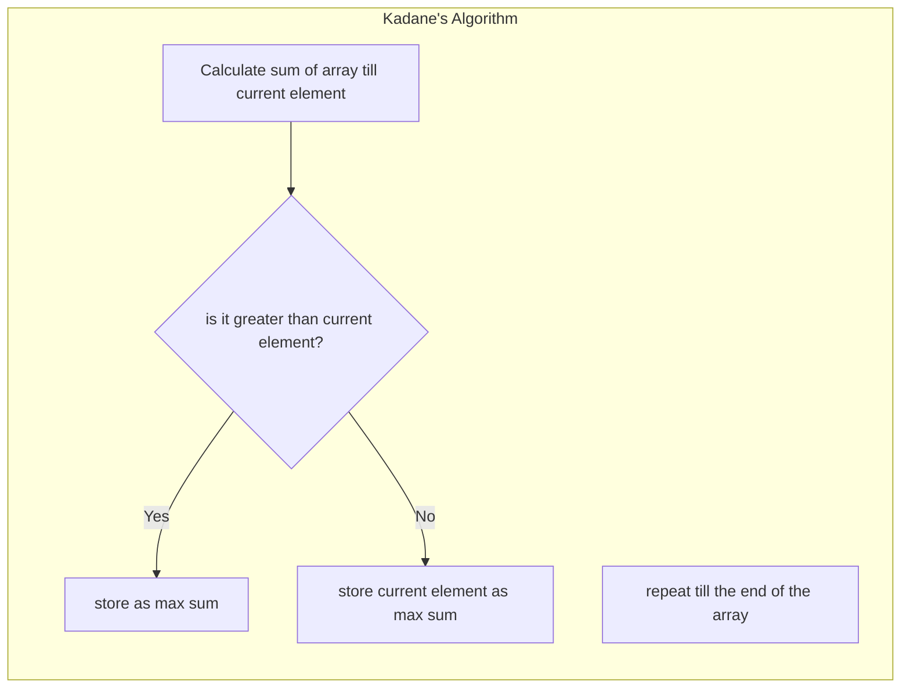

# Kadane's Algorithm

It is used to calculate the maximum sub array sum 

```mermaid
graph LR
    subgraph "Kadane's Algorithm";
    step1[Calculate sum of array till current element] --> step2{is it greater than current element?};
    step2 -- Yes --> step3[store as max sum];
    step2 -- No --> step4[store current element as max sum];
    step5[repeat till the end of the array];
end
```

[implementation](../../Algorithms/Misc/include/kadane.hpp)