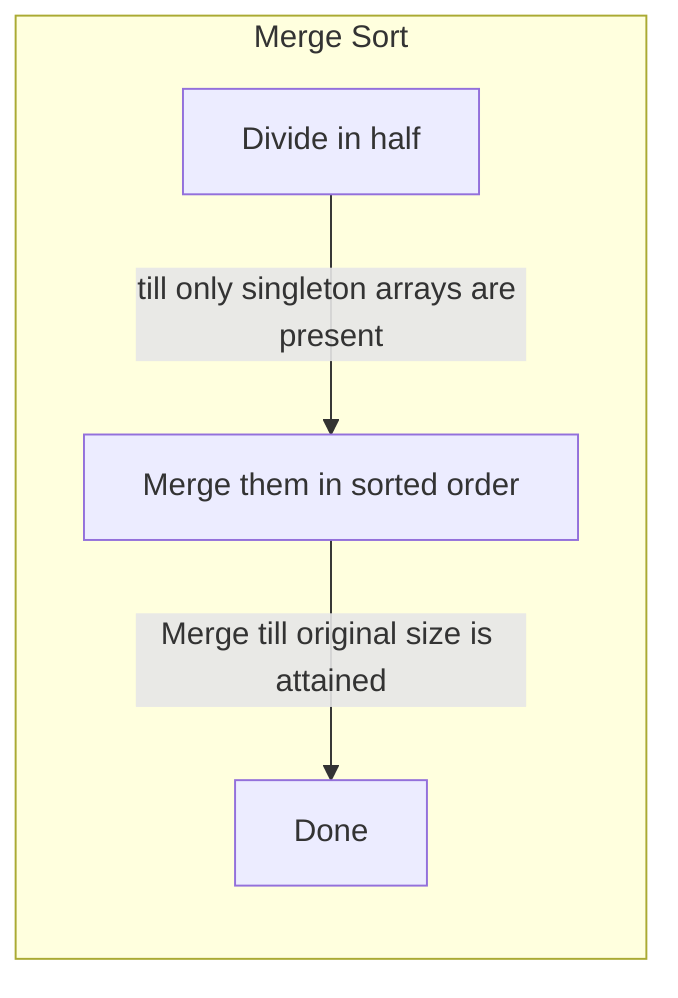

# Merge Sort

1. It is based on divide and conquer approach
2. It utilizes the fact that _singleton arrays are always sorted_
3. It has $`O(Nlog(N))`$ time complexity and $`O(N)`$ space complexity



```c++
//Example
// [2,3,-1,1]
// [2,3] , [-1,1]
// [2] , [3] , [-1] , [1]
// [2,3], [-1,1]
// [-1,1,2,3] //sorted

void merge(std::vector<int> &v, const size_t left, const size_t mid, const size_t right)
{
	const size_t n1 = mid - left + 1;
	const size_t n2 = right - mid;
	std::vector<int> sub1(n1), sub2(n2);

	for (size_t i = 0; i < n1; i++)
	{
		sub1.at(i) = v.at(left + i);
	}
	for (size_t j = 0; j < n2; j++)
	{
		sub2.at(j) = v.at(mid + 1 + j);
	}
	size_t i{0}, j{0}, k{left};

	while (j < n2 && i < n1)
	{
		if (sub1.at(i) >= sub2.at(j))
		{
			v.at(k) = sub2.at(j);
			j++;
		}
		else
		{
			v.at(k) = sub1.at(i);
			i++;
		}
		k++;
	}
	while (i < n1)
	{
		v.at(k) = sub1.at(i);
		i++;
		k++;
	}
	while (j < n2)
	{
		v.at(k) = sub2.at(j);
		j++;
		k++;
	}
}

void merge_sort(std::vector<int> &v, size_t left, size_t right)
{
	if (left < right)
	{
		size_t mid = left + (right - left) / 2;
		merge_sort(v, left, mid);
		merge_sort(v, mid + 1, right);
		merge(v, left, mid, right);
	}
}
// implementation using templates and iterators
template <typename Iter>
void merge(Iter start, Iter mid, Iter end)
{
	std::vector<typename Iter::value_type> temp;
	temp.reserve(std::distance(start,end));
	Iter left{start}, right{mid};
	while (left != mid && right != end)
	{
		if (*right > *left)
		{
			temp.push_back(*left);
			left++;
		}
		else
		{
			temp.push_back(*right);
			right++;
		}
	}
	temp.insert(temp.end(), left, mid);
	temp.insert(temp.end(), right, end);
	std::move(temp.begin(), temp.end(), start);
}

template <typename Iter>
void merge_sort(Iter start, Iter end)
{
	int size = std::distance(start, end);
	if (size <= 1)
	{
		return;
	}
	auto mid = std::next(start, size / 2);
	merge_sort(start, mid);
	merge_sort(mid, end);
	merge(start, mid, end);
}


```
