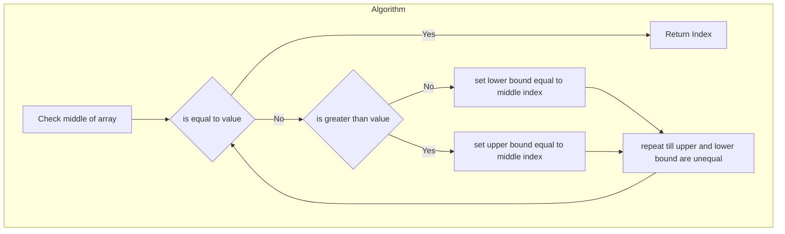

# Searching Algorithms

## Linear Search

It can be implemented in many ways

```c++
// simple for loop
int linear_search(std::vector<int> &v, int value)
{
    for(int i = 0; i < v.size(); i++)
        if(v.at(i) == value)
            return i;
    return -1;
}

//using std::find

int index = std::find(v.begin(), v.end(), value);
```

## Binary search

Faster way to search within sorted data


