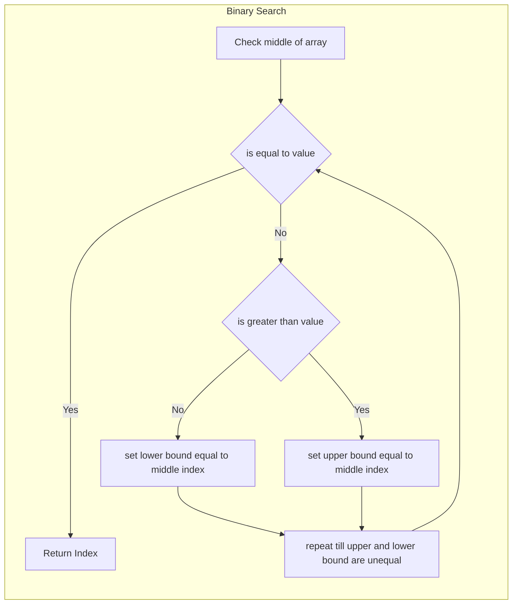

# Searching Algorithms

## Linear Search

It can be implemented in many ways

```c++
// simple for loop
int linear_search(std::vector<int> &v, int value)
{
    for(int i = 0; i < v.size(); i++)
        if(v.at(i) == value)
            return i;
    return -1;
}

//using std::find

int index = std::find(v.begin(), v.end(), value);
```

## Binary search

Faster way to search within sorted data

$`O(log(N))`$ time complexity



```c++
//simple recursive implementation

int binary_search(std::vector<int> &v, int value, size_t hi = v.size()-1, size_t lo = 0)
{
    if(hi == lo)
        return -1;
    int mid = (lo + hi)/2;
    if(v.at(mid) == value)
        return mid;
    else if(v.at(mid) > value)
        hi = mid;
    else
        lo = mid;
    return binary_search(v, value, hi, lo);
}
```
