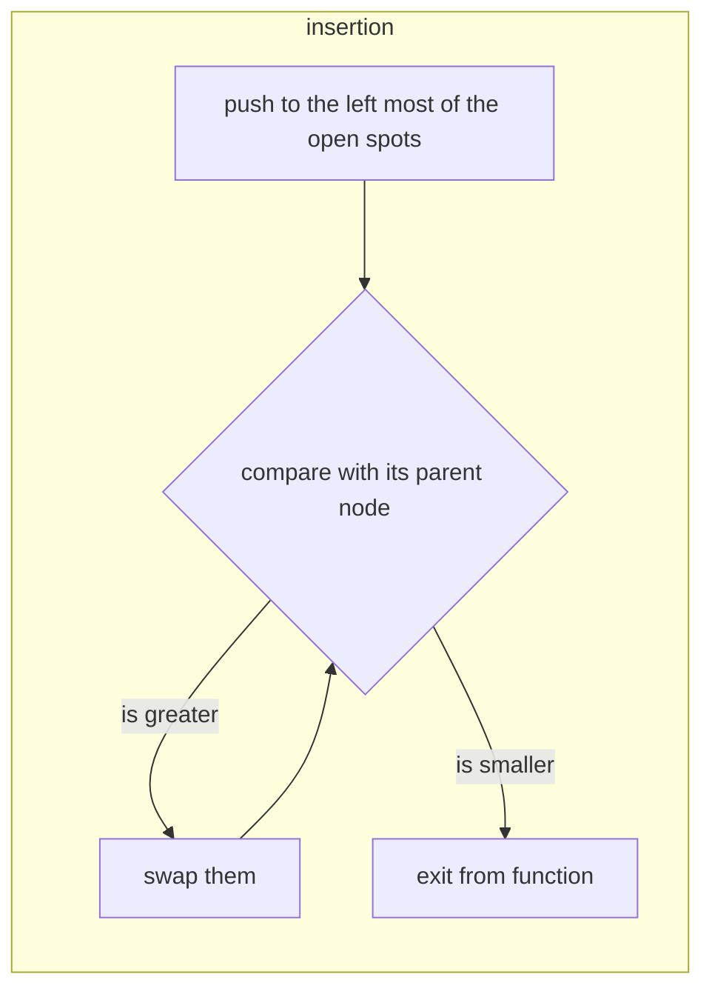
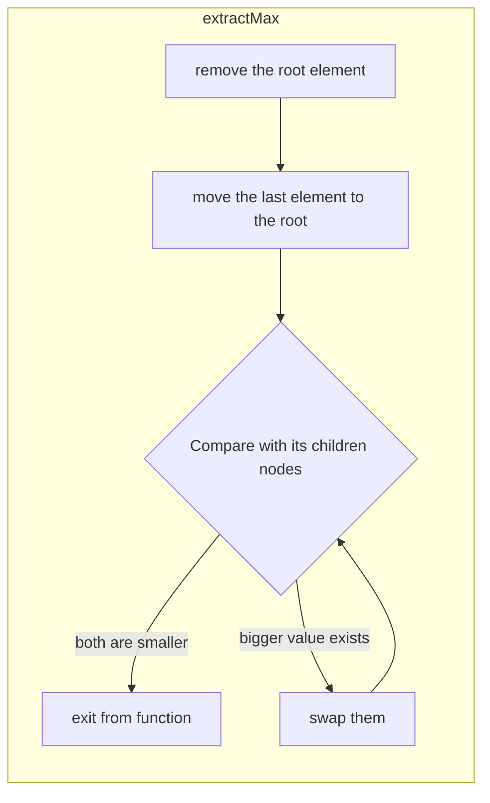

# [(max) Binary Heap](../../DataStructures/BinaryHeaps/include/BinaryHeap.hpp)

## Main relation

Parent nodes always store larger values than their children nodes.
Sibling nodes do not have any relation in their values.

## Operations

1. Insertion 

2. Extracting max element

