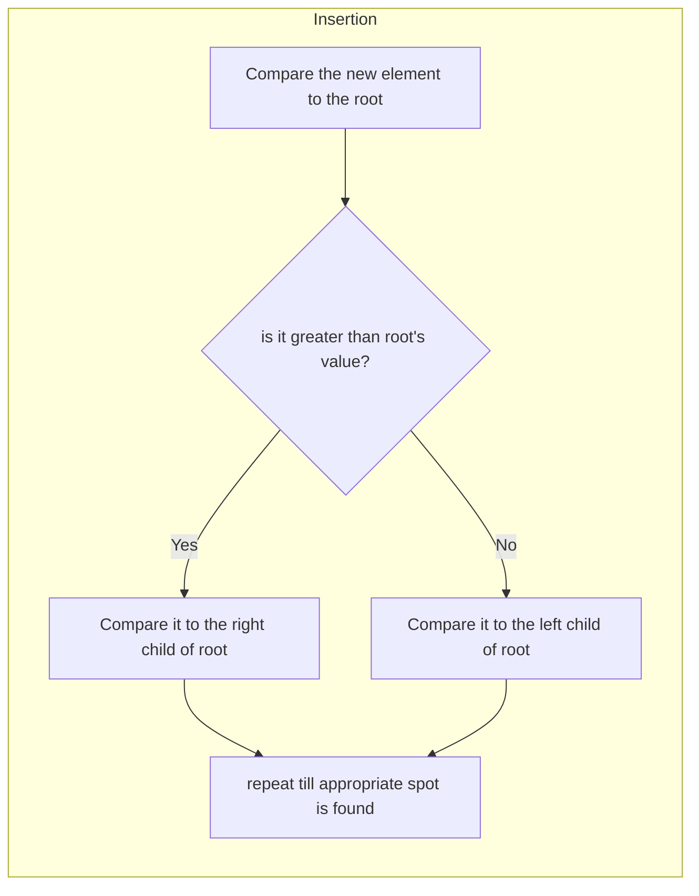

# [Binary Search Tree](../../DataStructures/BinarySearchTree/include/BST.hpp)

## Implementation details

1. BST node
   1. data variable
   2. left node pointer
   3. right node pointer

2. BST class stores a root pointer

## Operations

1. Insertion ($`O(log(N))`$ time)

2. search ($`O(log(N))`$ time)

    Algorithm is same as binary search

3.  max , min element

    Same as binary search
