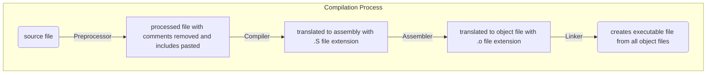

# Writing Makefiles



## g++ options

1. `-E` to run just the preprocessor
2. `-S` to run compiler and generate assembly files
3. `-c` to generate object files

## makefile syntax

```makefile

# This is a comment

target: dependencies #basic recipe template
    actions

```
