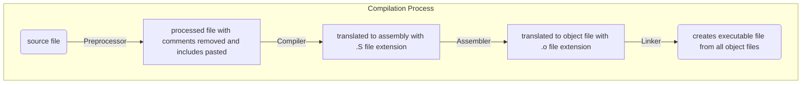

# Writing [Makefiles](https://makefiletutorial.com/)



## g++ options

1. `-E` to run just the preprocessor
2. `-S` to run compiler and generate assembly files
3. `-c` to generate object files

## makefile syntax

```makefile
# This is a comment

# basic recipe template
target: dependencies
    actions

# variables
name = value

# accessing variable
name1 = $(name)
name2 = ${name}
```

```makefile

# Targets

all: one two three

one:
    echo 1
two:
    echo 2
three:
    echo 3

# multiple targets

all: f1.o f2.o

# $@ is the automatic variable which contains the target name
f1.o f2.o:
    echo $@

# Equivalent to
# f1.o:
#     echo $@
# f2.o:
#     echo $@

# Automatic variables and wildcards
# * and % are wildcards in makefiles
# * is used for pattern matching

SRC = $(wildcard *.cpp)
# finds all .cpp files and adds them to this variable

OBJ = $(wildcard *.o)
# finds all .o files and adds them to this variable

```

## % Wildcard

% is really useful, but is somewhat confusing because of the variety of situations it can be used in.

- When used in "matching" mode, it matches one or more characters in a string. This match is called the stem.

- When used in "replacing" mode, it takes the stem that was matched and replaces that in a string.
- `%` is most often used in rule definitions and in some specific functions.

## Automatic Variables

there are many but the few given below are common

```makefile
hey: one two
    # Outputs "hey", since this is the first target
    echo $@

    # Outputs all prerequisites newer than the target
    echo $?

    # Outputs all prerequisites
    echo $^

    touch hey

one:
    touch one

two:
    touch two

clean:
    rm -f hey one two

```

## Pattern rules

```makefile
# simple rule for compiling files
# this will compile all edited files to object files
%.o: %.cpp
    g++ -c $< -o $@

# more general
OBJDIR = obj

$(OBJDIR)/%.o : $(SRC)/%.cpp
    $(CXX) -c $(CFLAGS) $< -o $@

```
