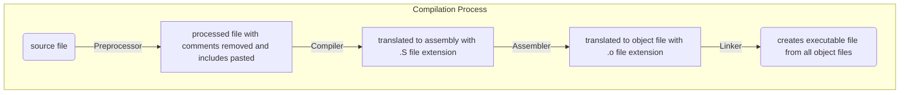

# Writing [Makefiles](https://makefiletutorial.com/)



## g++ options

1. `-E` to run just the preprocessor
2. `-S` to run compiler and generate assembly files
3. `-c` to generate object files

## makefile syntax

```makefile
# This is a comment

# basic recipe template
target: dependencies
    actions

# variables
name = value

# accessing variable
name1 = $(name)
name2 = ${name}
```

```makefile

# Targets

all: one two three

one:
    echo 1
two:
    echo 2
three:
    echo 3

# multiple targets

all: f1.o f2.o

# $@ is the automatic variable which contains the target name
f1.o f2.o:
    echo $@

# Equivalent to
# f1.o:
#     echo $@
# f2.o:
#     echo $@


```
